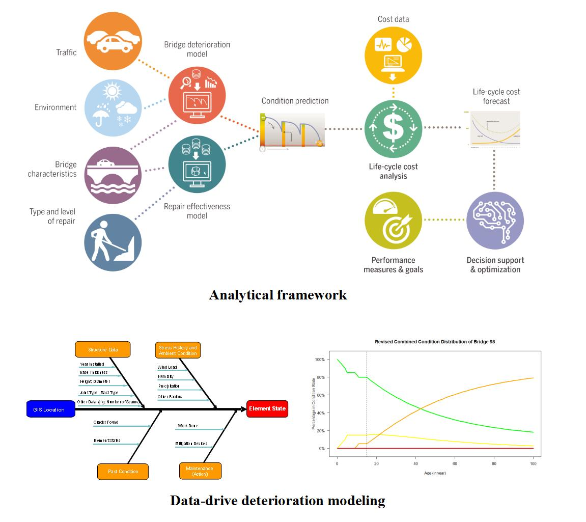
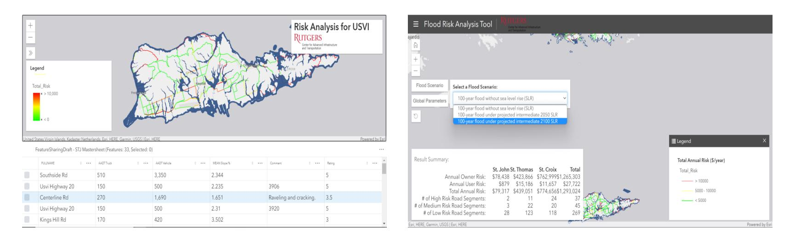
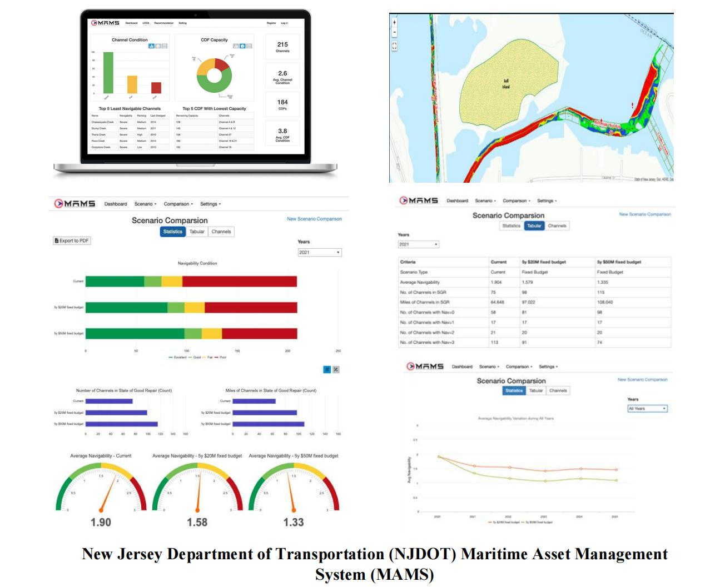
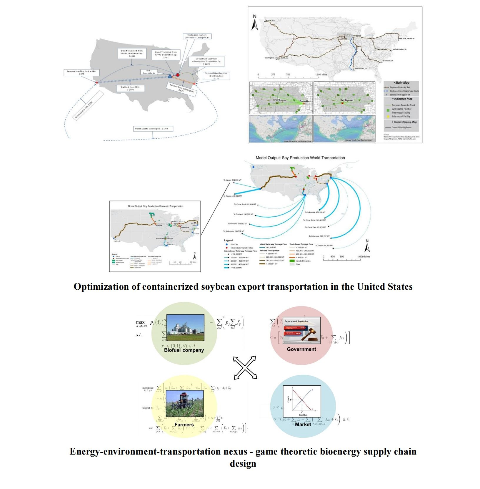
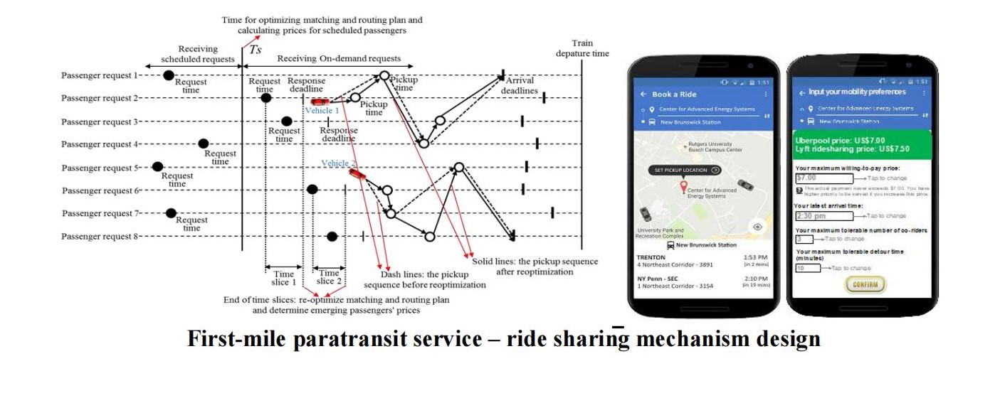

The laboratory offers an extensive array of research topics, each meticulously designed to delve into the most pressing questions and cutting-edge advancements across various scientific disciplines. Here are some themes and techniques that we currently work on:

## Digitalization and Intelligent Transportation Infrastructure Asset Management

#### Instance1: Bridge and ancillary structure asset management

#### Instance2: Risk-based transportation asset management and resilience planning

#### Instance3: Maritime asset management framework and decision support tool

## Multi-Modal, Complex Transportation Systems Network Modeling

#### Instance1: Freight logistics system modeling and supply chain network design

#### Instance2: Smart Mobility

